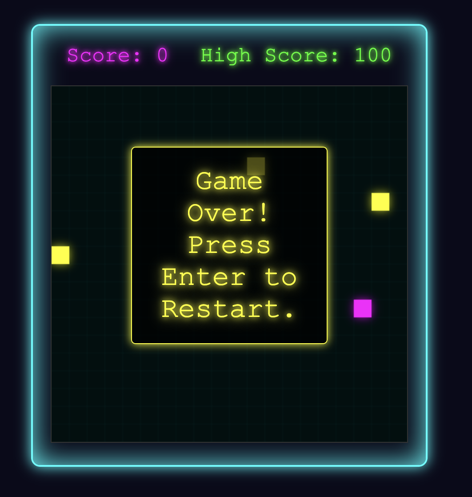

gi# Neon Snake Game Deluxe 🐍✨

A modern twist on the classic snake game with glowing neon visuals and particle effects.



## Features
- 🌟 Glowing snake head with fading tail segments
- 💥 Particle effects when collecting food/power-ups
- ⚡ Explosion animation on game over
- 🌈 Dynamic background grid with pulse effect
- 🚀 Optimized rendering performance

## How to Play
- Use arrow keys to control the snake
- Collect glowing food to grow longer
- Grab power-ups for temporary speed boost
- Avoid walls, obstacles, and your own tail

## Installation
1. Clone the repository:
```bash
git clone https://github.com/kevinschueller/neon-snake-game-deluxe.git
```
2. Open `index.html` in your browser

## Requirements
- Modern web browser (Chrome, Firefox, Edge)
- JavaScript enabled

## Controls
- ← ↑ → ↓ Arrow keys to move
- Enter to restart after game over

## Credits
Developed with vanilla JavaScript, HTML5 Canvas, and CSS3

## License
MIT License - free to use and modify
