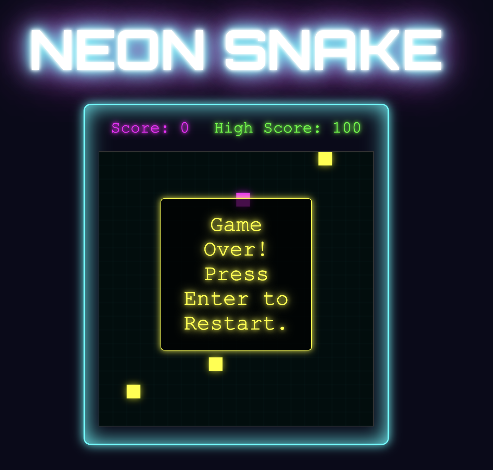

<p align="center">
  <h1>Neon Snake Game Deluxe 🐍✨</h1>
</p>

[](https://opensource.org/licenses/MIT)

A modern twist on the classic snake game, built with vanilla JavaScript, HTML5 Canvas, and CSS3. Features glowing neon visuals, particle effects, and dynamic gameplay elements.



## Features
- 🌟 Glowing snake head with a fading tail effect.
- 💥 Particle explosions when collecting food/power-ups and on game over.
- ⚡ Temporary speed boost power-ups (🟠).
- 🧱 Dynamic obstacles (🟡) that appear during gameplay.
- 🌈 Dynamic background grid with a subtle pulse effect.
- 🏆 High score tracking using local storage.
- 🚀 Optimized rendering using `requestAnimationFrame`.

## How to Play
- Use the **Arrow Keys** (← ↑ → ↓) to control the snake's direction.
- Collect the glowing **magenta food** (🟣) to grow longer and increase your score.
- Grab the flashing **orange power-ups** (🟠) for a temporary speed boost.
- Avoid hitting the **walls**, the **yellow obstacles** (🟡), and your own tail.
- Press **Enter** to restart the game after a game over.

## Installation & Setup
1. Clone the repository:
   ```bash
   git clone https://github.com/kevinschueller/neon-snake-game-deluxe.git
   ```
2. Navigate to the project directory:
   ```bash
   cd neon-snake-game-deluxe
   ```
3. Open the `index.html` file in your web browser. No server needed!

## Code Overview
- **`index.html`**: Sets up the basic HTML structure, including the `<canvas>` element for the game, score displays, and the game over message container. Links the CSS and JavaScript files.
- **`style.css`**: Defines the visual appearance and layout. Styles the game container, canvas, score text, game over message, and applies neon glow effects using `text-shadow` and `box-shadow`.
- **`script.js`**: Contains all the game logic:
    - **Canvas Rendering**: Handles drawing the snake, food, power-ups, obstacles, background grid, and particle effects.
    - **Game State**: Manages the snake's position, score, high score, speed, and game running status.
    - **Movement & Collision**: Updates the snake's position based on input and checks for collisions with walls, self, and obstacles.
    - **Item Spawning**: Randomly generates food, power-ups, and obstacles in valid locations.
    - **Power-ups**: Implements the speed boost effect and duration.
    - **Particles**: A simple particle system for visual feedback on events.
    - **Input Handling**: Listens for keyboard events (arrow keys for movement, Enter for restart).
    - **Game Loop**: Uses `requestAnimationFrame` for smooth animation and updates game state at intervals based on `currentSpeed`.
    - **Local Storage**: Persists the high score between sessions.

## Requirements
- A modern web browser that supports HTML5 Canvas and JavaScript (e.g., Chrome, Firefox, Safari, Edge).
- JavaScript must be enabled.

## License
This project is licensed under the MIT License.
